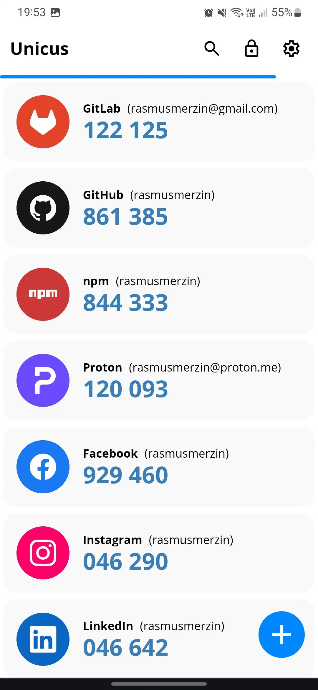
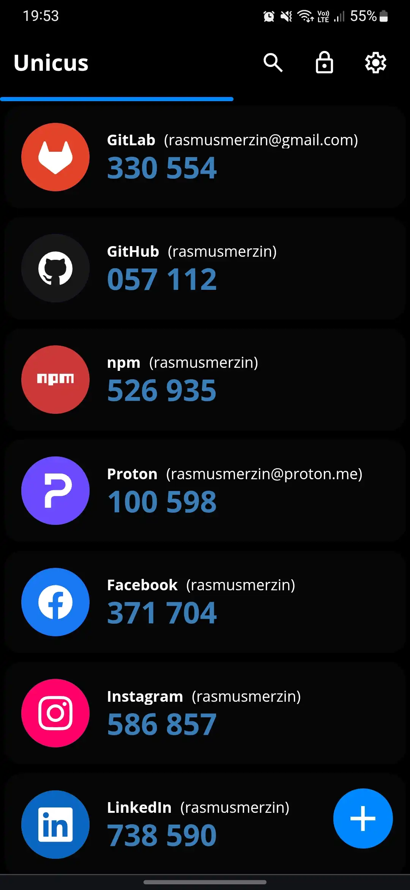
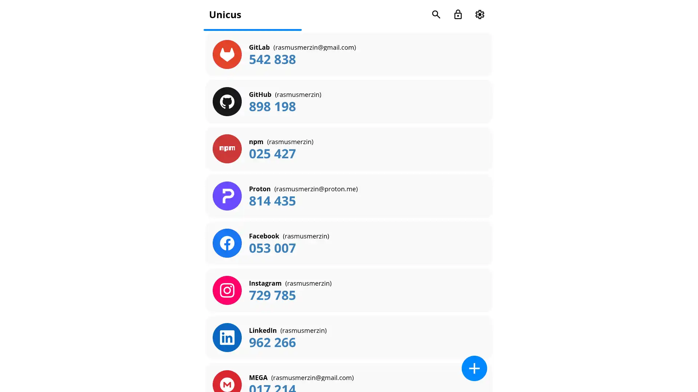

# Unicus Authenticator

Unicus Authenticator is a free, secure and open source 2FA progressive web app.
It aims to provide a secure authenticator for your online services, while also
including some features missing in existing authenticator apps, like proper
encryption and backups. Unicus supports HOTP and TOTP, making it compatible with
thousands of services.

## Features

- Encrypted vault
  - With password and optional biometric authentication
- Add OTP entries manually
- Scan QR codes with camera or from image
  - Single OTP
  - Multiple OTP migration (Google Authenticator)
- View entries' QR codes
- Export entries to migration QR codes (Google Authenticator)
- Export vault to a file
- Import vault from a file
- Automatically lock vault after inactivity (and optionally on app hide)
- Dark mode
- OTP issuer icons (from [aegis-icons](https://aegis-icons.github.io))

## Screenshots

  
  

  
  

## License

This project is licensed under the [MIT License](./LICENSE).
